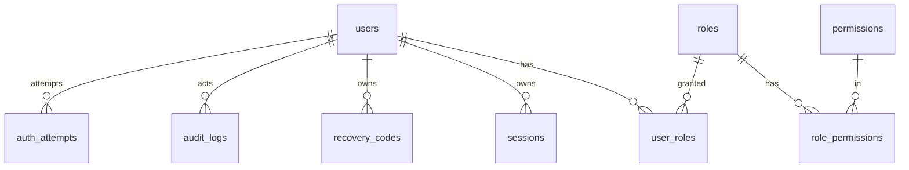

# Leximochi 数据库设计（初始 ER）

> 基线：`开发提示词.md`、`SECURITY-GUARDRAILS.md`、`docs/architecture.md`。
> 本文件描述**已实现**的表结构与约束；结构变更必须通过 migration，并同步更新本文件。

- 版本：v1（Phase 1）
- 更新：2026-09-21
- 数据库：SQLite（Drizzle ORM + better-sqlite3）

---

## 1. 通用约定

| 约定 | 说明 |
| --- | --- |
| ID | `TEXT`，UUID v4（`node:crypto.randomUUID()`）。避免自增 ID 被枚举与猜测归属 |
| 时间 | `INTEGER`，UTC epoch 毫秒。由服务端生成，不采信客户端时间 |
| 布尔 | `INTEGER` 0/1 |
| 枚举 | `TEXT` + 应用层校验（SQLite 无原生枚举）；必要时加 `CHECK` 约束 |
| 外键 | 连接建立即 `PRAGMA foreign_keys=ON`；删除策略显式声明（`CASCADE` / `SET NULL`） |
| 命名 | 表名与列名 `snake_case` |
| 秘密 | 只存哈希或密文；禁止明文密码、恢复码、Token、API Key |

### 1.1 连接参数（启动时设置并断言）

| PRAGMA | 值 | 目的 |
| --- | --- | --- |
| `journal_mode` | `WAL` | 读写并发、崩溃恢复 |
| `busy_timeout` | `5000` | 避免瞬时锁冲突直接失败 |
| `foreign_keys` | `ON` | 引用完整性 |
| `synchronous` | `NORMAL` | WAL 下的性能/安全平衡 |

---

## 2. ER 总览



Phase 1 表清单：`users`、`roles`、`permissions`、`role_permissions`、`user_roles`、`sessions`、`recovery_codes`、`auth_attempts`、`captcha_challenges`、`audit_logs`。

> 词库、学习记录、复习调度、宠物、奖励流水（Reward Ledger）、勋章等表属于 Phase 2 及以后，**Phase 1 不创建**（避免空表与无调用方的抽象）。命名空间预留：`vocabulary_*`、`study_*`、`pet_*`、`reward_*`、`achievement_*`、`listening_*`、`speaking_*`、`ai_*`。

---

## 3. 表结构

### 3.1 `users`

| 列 | 类型 | 约束 | 说明 |
| --- | --- | --- | --- |
| `id` | TEXT | PK | UUID v4 |
| `username` | TEXT | NOT NULL | 展示用用户名（保留用户输入的大小写形式） |
| `username_canonical` | TEXT | NOT NULL, UNIQUE | 规范化形式（小写 + 去除首尾空白 + NFKC），用于唯一性与登录查找 |
| `password_hash` | TEXT | NOT NULL | Argon2id 编码串（含参数与盐） |
| `password_algo` | TEXT | NOT NULL DEFAULT `'argon2id'` | 便于未来算法升级 |
| `password_updated_at` | INTEGER | NOT NULL | 改密时间；用于「改密后撤销旧会话」 |
| `status` | TEXT | NOT NULL DEFAULT `'active'` | `active` / `banned` |
| `banned_reason` | TEXT | NULL | 封禁原因（管理员填写） |
| `banned_at` | INTEGER | NULL | 封禁时间 |
| `banned_by` | TEXT | NULL, FK → `users.id` ON DELETE SET NULL | 操作管理员 |
| `created_at` | INTEGER | NOT NULL | |
| `updated_at` | INTEGER | NOT NULL | |
| `last_login_at` | INTEGER | NULL | |

索引：`UNIQUE(username_canonical)`、`INDEX(status)`。

**约束说明**：禁止用 `username` 原样做唯一性判断（避免 `Alice` / `alice` 双账号导致冒充），唯一性一律基于 `username_canonical`。

### 3.2 `roles` / `permissions` / `role_permissions` / `user_roles`

`roles`

| 列 | 类型 | 约束 |
| --- | --- | --- |
| `id` | TEXT | PK |
| `key` | TEXT | NOT NULL, UNIQUE（`user` / `admin`） |
| `name` | TEXT | NOT NULL |
| `description` | TEXT | NULL |
| `is_system` | INTEGER | NOT NULL DEFAULT 0（系统角色不可删除） |
| `created_at` | INTEGER | NOT NULL |

`permissions`

| 列 | 类型 | 约束 |
| --- | --- | --- |
| `id` | TEXT | PK |
| `key` | TEXT | NOT NULL, UNIQUE（如 `admin.users.read`、`admin.users.ban`、`admin.audit.read`） |
| `description` | TEXT | NULL |
| `created_at` | INTEGER | NOT NULL |

`role_permissions`：`role_id` + `permission_id` 复合主键，两者 `FK ON DELETE CASCADE`。

`user_roles`：`user_id` + `role_id` 复合主键，`granted_at`、`granted_by`(FK → `users.id`, ON DELETE SET NULL)；`FK ON DELETE CASCADE`。

Phase 1 种子数据（migration 写入，幂等）：

| role | permissions |
| --- | --- |
| `user` | 无（普通用户不使用后台权限） |
| `admin` | `admin.users.read`、`admin.users.ban`、`admin.audit.read` |

### 3.3 `sessions`

| 列 | 类型 | 约束 | 说明 |
| --- | --- | --- | --- |
| `id` | TEXT | PK | 同时作为 Access Token 的 `sid` |
| `user_id` | TEXT | NOT NULL, FK → `users.id` ON DELETE CASCADE | |
| `family_id` | TEXT | NOT NULL | 轮换族标识；复用检测时按族整体撤销 |
| `refresh_token_hash` | TEXT | NOT NULL, UNIQUE | `HMAC-SHA256(token, REFRESH_TOKEN_SECRET)` 十六进制 |
| `expires_at` | INTEGER | NOT NULL | |
| `revoked_at` | INTEGER | NULL | |
| `revoked_reason` | TEXT | NULL | `logout` / `rotated` / `reuse_detected` / `password_changed` / `recovery_used` / `banned` / `logout_all` |
| `user_agent` | TEXT | NULL | 设备会话管理与审计 |
| `ip` | TEXT | NULL | 登录来源（安全审计用途） |
| `created_at` | INTEGER | NOT NULL | |
| `last_used_at` | INTEGER | NULL | |

索引：`UNIQUE(refresh_token_hash)`、`INDEX(user_id)`、`INDEX(family_id)`、`INDEX(expires_at)`。

### 3.4 `recovery_codes`

| 列 | 类型 | 约束 |
| --- | --- | --- |
| `id` | TEXT | PK |
| `user_id` | TEXT | NOT NULL, FK → `users.id` ON DELETE CASCADE |
| `code_hash` | TEXT | NOT NULL（Argon2id；禁止明文/可逆） |
| `created_at` | INTEGER | NOT NULL |
| `used_at` | INTEGER | NULL（非空即失效） |
| `used_ip` | TEXT | NULL |

索引：`INDEX(user_id, used_at)`。

说明：注册时一次性生成 10 个，明文只在注册响应中返回一次，之后任何接口都不再返回；使用后立即置 `used_at`；恢复成功后撤销该用户全部会话；恢复成功后按策略重新生成一组新恢复码（旧的全部作废）。

### 3.5 `auth_attempts`

用于限流与暴力破解防护（按用户名与 IP 维度计数）。

| 列 | 类型 | 约束 |
| --- | --- | --- |
| `id` | TEXT | PK |
| `kind` | TEXT | NOT NULL（`login` / `register` / `refresh` / `recovery` / `captcha`） |
| `username_canonical` | TEXT | NULL |
| `ip` | TEXT | NULL |
| `success` | INTEGER | NOT NULL（0/1） |
| `created_at` | INTEGER | NOT NULL |

索引：`INDEX(kind, username_canonical, created_at)`、`INDEX(kind, ip, created_at)`、`INDEX(created_at)`。

### 3.6 `captcha_challenges`

| 列 | 类型 | 约束 |
| --- | --- | --- |
| `jti` | TEXT | PK（挑战唯一标识，防重放） |
| `answer_hash` | TEXT | NOT NULL（HMAC-SHA256(答案, 服务端密钥)） |
| `expires_at` | INTEGER | NOT NULL |
| `consumed_at` | INTEGER | NULL |
| `ip` | TEXT | NULL |
| `created_at` | INTEGER | NOT NULL |

索引：`INDEX(expires_at)`。

### 3.7 `audit_logs`

| 列 | 类型 | 约束 | 说明 |
| --- | --- | --- | --- |
| `id` | TEXT | PK | |
| `actor_user_id` | TEXT | NULL, FK → `users.id` ON DELETE SET NULL | 匿名事件为 NULL |
| `actor_type` | TEXT | NOT NULL | `user` / `admin` / `system` / `anonymous` |
| `action` | TEXT | NOT NULL | 如 `auth.login.succeeded`、`admin.user.banned` |
| `target_type` | TEXT | NULL | 如 `user` |
| `target_id` | TEXT | NULL | |
| `result` | TEXT | NOT NULL | `success` / `failure` |
| `metadata_json` | TEXT | NULL | **脱敏后**的结构化补充信息 |
| `request_id` | TEXT | NULL | 关联请求日志 |
| `ip` | TEXT | NULL | |
| `user_agent` | TEXT | NULL | |
| `created_at` | INTEGER | NOT NULL | |

索引：`INDEX(action, created_at)`、`INDEX(actor_user_id, created_at)`、`INDEX(target_type, target_id, created_at)`。

**严格禁止**写入：密码、恢复码明文/哈希、Token、API Key、Cookie、完整请求体。

---

## 4. 事务与幂等

| 场景 | 事务范围 | 幂等保障 |
| --- | --- | --- |
| 注册 | 事务内插入 `users` + 10 条 `recovery_codes` + 授予 `user` 角色 | `UNIQUE(username_canonical)` |
| 登录 | 读用户 + 写 `sessions` + 更新 `last_login_at` | 会话 ID 主键 |
| 刷新 | 撤销旧会话 + 插入新会话（同一 `family_id`） | 旧 token 哈希唯一，且撤销后不可再用 |
| 恢复密码 | 标记恢复码 `used_at` + 更新密码 + 撤销全部会话 + 重建恢复码 | 恢复码行级「未使用」条件更新（`WHERE used_at IS NULL` 且影响行数=1） |
| 封禁 | 更新 `users.status` + 撤销全部会话 + 写审计 | 状态条件更新 |

要点：

1. 幂等以**唯一约束 / 条件更新影响行数**兜底，禁止「先查后写」。
2. 恢复码使用必须是 `UPDATE ... WHERE id = ? AND used_at IS NULL`，影响行数为 0 即判定为已用/无效。
3. 所有金额/奖励类写入（Phase 3 起）必须在同一事务内完成并写 Reward Ledger。

---

## 5. Migration 策略

1. 结构变更只通过 `drizzle-kit generate` 生成的 SQL 文件（`apps/server/drizzle/`）落地，文件入库 Git。
2. 应用启动时执行 `migrate.ts`：读取 drizzle journal，应用未执行的 migration；失败则**拒绝启动**。
3. 已发布的 migration 不得修改内容或调序，只能追加新 migration。
4. 破坏性变更（删表/删列/改类型）必须在同一迁移前提供数据迁移与备份说明。
5. migration 文件内禁止包含明文秘密与真实用户数据。

---

## 6. 备份与恢复

- `data/backups/` 存放备份；备份前执行 WAL checkpoint 或使用 SQLite 在线备份 API，保证一致性快照。
- 备份文件不入 Git，权限受限。
- 恢复流程文档化（`docs/`），并**实际演练**后才能声明「备份可用」；演练结果记入 `HANDOFF.md`。
- 备份产物不得包含明文秘密。

---

## 7. 管理员初始化

不通过硬编码或默认密码创建管理员。Phase 1 提供脚本：

```bash
# 密码从环境变量读取，避免出现在命令历史与进程列表中
ADMIN_PASSWORD='<strong-password>' npm run --workspace apps/server create-admin -- --username <name>
```

脚本行为：校验密码强度（与服务端同一套 `packages/core` 规则）→ 在事务中创建用户并授予 `admin` 角色 → 写审计事件（`admin.bootstrap.created`）→ 输出用户名（不输出密码）。重复执行需显式 `--allow-existing`，否则报错退出。

---

## 8. 与安全红线的对应关系

| 红线要求 | 本设计的落实 |
| --- | --- |
| 密码/恢复码安全哈希 | `password_hash`、`code_hash` 均为 Argon2id |
| 无明文秘密 | 表中不存 Token 明文；Refresh Token 只存 HMAC |
| 越权 / IDOR | 归属列（`user_id`）+ 服务层归属校验 + UUID 主键 |
| 幂等与防重复 | 唯一约束、条件更新、事务 |
| 审计 | `audit_logs` 覆盖管理员操作与敏感认证事件 |
| 数据完整性 | WAL、`busy_timeout`、外键、事务、migration、备份 |
| 时间可信 | 全部时间由服务端 UTC 生成 |

---

## 9. Phase 2 新增表（单词核心）

迁移：`apps/server/drizzle/0001_thin_pandemic.sql`（13 张表 / 19 个外键）。
通用约定与第 1 节一致（TEXT UUID 主键、INTEGER UTC 毫秒、布尔 0/1、外键显式 ON DELETE）。

### 9.1 词库与词条（纯数据，不硬编码任何具体词库）

| 表 | 关键列与约束 |
| --- | --- |
| `wordbooks` | `key` UNIQUE（如 `cet4`/`cet6`，**仅是数据**）、`name`、`language`、`is_system`、`version`（内容变化递增，供离线下载比对）、`word_count`、`created_at`/`updated_at` |
| `words` | `headword`、`headword_canonical` UNIQUE（归一化后唯一）、`phonetic_uk`/`phonetic_us`、`audio_uk_key`/`audio_us_key`（仅存 StorageProvider key，**不得存绝对路径**）、`source`（`dictionary`/`imported`） |
| `wordbook_entries` | PK `(wordbook_id, word_id)`，`rank`（词库内教学顺序），`tags_json`（如 `["高频"]`）；两个外键均 `ON DELETE CASCADE`；索引 `(wordbook_id, rank)` |
| `word_senses` | `definition_zh` 必填、`definition_en`、`exam_meaning`（**四六级常考含义**）、`part_of_speech`、`sort_order` |
| `word_examples` | `text_en`/`text_zh` 必填、`audio_key`、`sense_id` 可空（`ON DELETE SET NULL`） |
| `word_phrases` | `kind`（`phrase`/`collocation`）区分常见短语与常见搭配，`text`/`translation` 必填 |
| `word_forms` | `form_type`（`past`/`plural`/`comparative`/…）+ `value` |
| `word_relations` | `relation_type`（`synonym`/`antonym`/`confusable`），`target_word_id` 可空（`SET NULL`）+ `target_text` 可空（目标词可能尚未入库） |
| `word_ai_notes` | `word_id` UNIQUE；只含 `memory_tip`/`usage_note`/`confusable_note`/`extra_examples_json` + `provider`/`model`/`generated_at`。**AI 内容独立成表，永不写入词典表** |

### 9.2 用户学习数据

| 表 | 关键列与约束 |
| --- | --- |
| `user_word_states` | PK `(user_id, word_id)`；SM-2 状态：`status`、`ease_factor`、`interval_days`、`repetitions`、`lapses`、`due_at`、`last_reviewed_at`、`first_learned_at`、`total_reviews`、`correct_reviews`；索引 `(user_id, due_at)`、`(user_id, status)` |
| `review_logs` | `event_id` **UNIQUE**（幂等最后防线）；全量留痕：`question_type`、`answer_raw`、`is_correct`、`rating`、`duration_ms`、`answered_at`、`client_answered_at`、`ease_factor_after`、`interval_days_after`、`repetitions_after`、`due_at_after`、`source`；索引 `(user_id, answered_at)`、`(user_id, word_id)` |
| `user_notebook` | PK `(user_id, word_id)`；`note`、`source`（`manual`/`from_review`/`from_listening`）、`added_at`；索引 `(user_id, added_at)` |
| `spelling_errors` | `review_log_id` 外键 `ON DELETE CASCADE`；`expected`/`actual`、`error_types`（逗号分隔：`missing_letter`/`duplicate_letter`/`order_error`/`wrong_letter`）；索引 `(user_id, word_id, created_at)` |

### 9.3 为什么不建统计表

学习历史与统计在 Phase 2 直接由 `review_logs` 聚合（今日新学/复习数、正确率、平均用时、已掌握词数、近 7 日趋势）。
理由：避免过早引入聚合表带来的一致性维护成本；`(user_id, answered_at)` 索引足以支撑当前数据量。若 Phase 3 出现性能瓶颈再评估物化统计。

### 9.4 与安全红线的对应

| 红线要求 | Phase 2 落实 |
| --- | --- |
| 客户端不可信 | 客户端只提交答题事实（`answer`/`durationMs`/`eventId`）；`ease_factor`/`interval_days`/`due_at` 等结果值只由服务端计算并写入 |
| 幂等与防重复 | `review_logs.event_id` UNIQUE + 单事务更新 `user_word_states` |
| 完整留痕（可迁移 FSRS） | `review_logs` 保存每次评分后的 `ease_factor_after`/`interval_days_after`/`repetitions_after`/`due_at_after` |
| 数据与 AI 内容区分 | `word_ai_notes` 独立表 + `words.source` 字段 |
| 文件路径安全 | 音频只存 `StorageProvider` key，不存绝对路径 |
